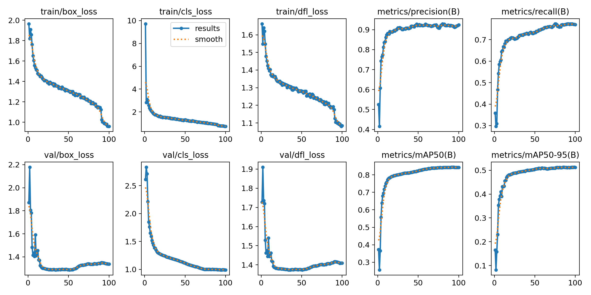
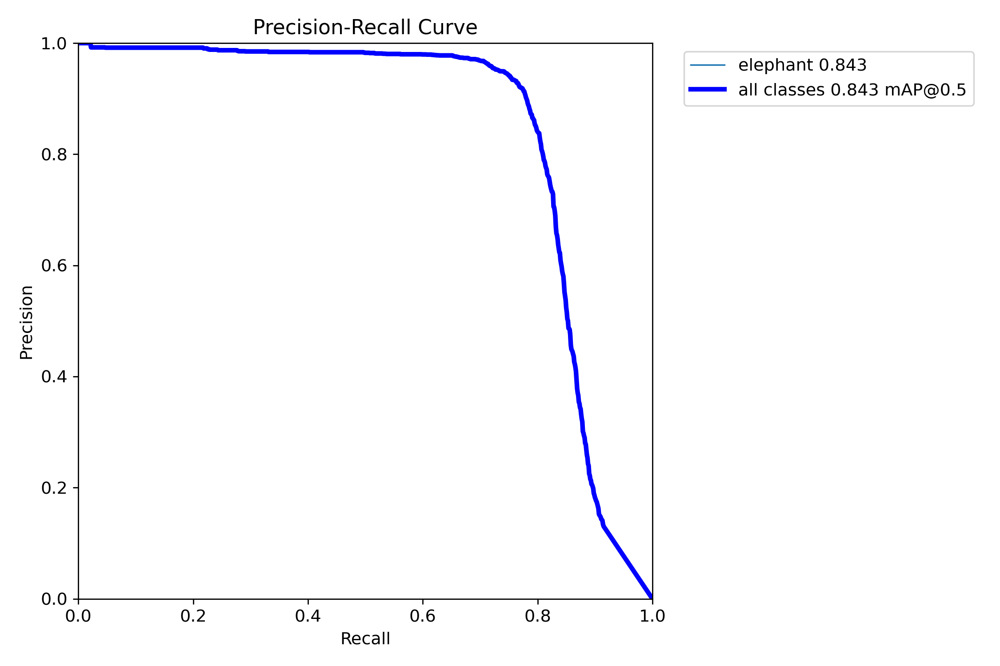
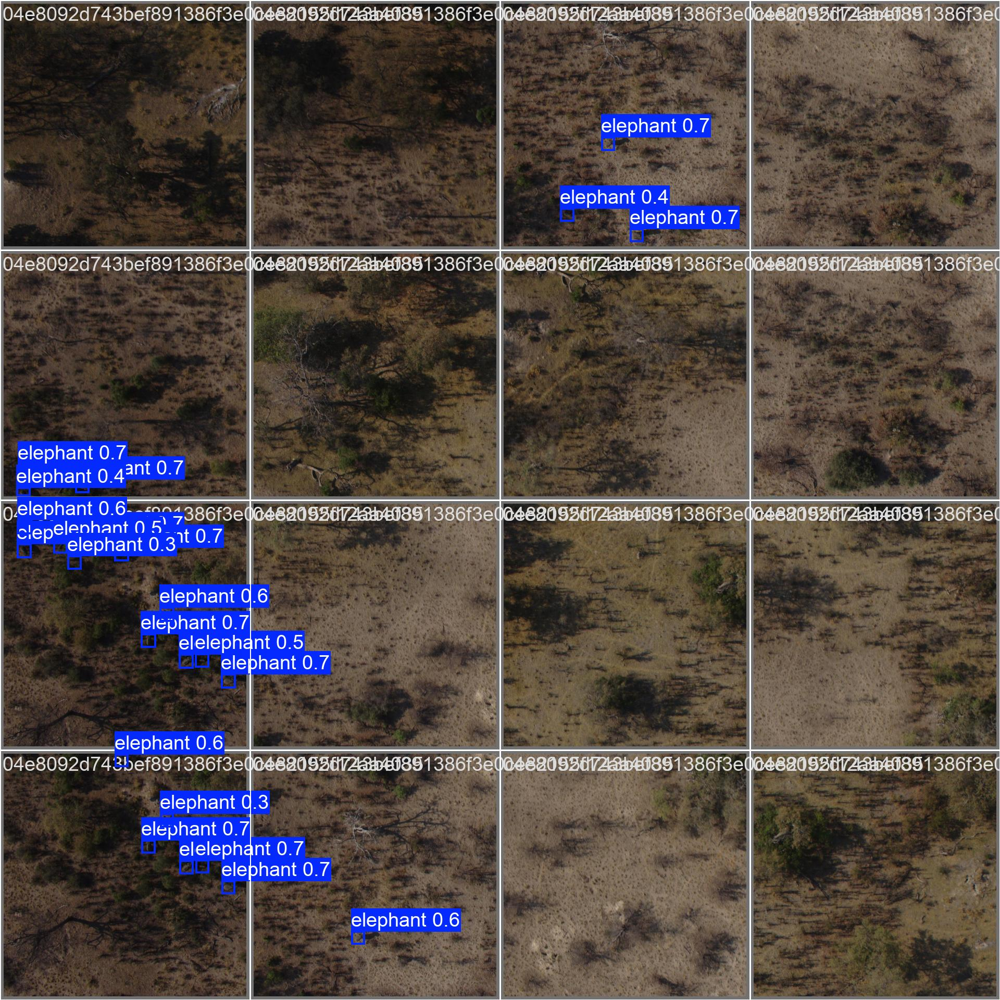

# EleFind — Aerial Elephant Detection

[](https://huggingface.co/spaces/iamhelitha/EleFind-gradio-ui)
[](https://huggingface.co/iamhelitha/EleFind-yolo11-elephant)
[](https://github.com/iamhelitha/EleFind-gradio-ui)

A web application for detecting elephants in aerial and drone imagery using [YOLOv11](https://docs.ultralytics.com/) with [SAHI](https://github.com/obss/sahi) (Slicing Aided Hyper Inference) and explainable AI heatmap visualizations.

## Features

- Real-time elephant detection with bounding boxes and confidence scores
- XAI Gaussian density heatmaps highlighting detection hotspots
- Adjustable SAHI parameters (confidence, slice size, overlap, IoU)
- Confidence bar charts and per-detection data tables
- Automatic model download from HuggingFace Hub

## Model

| Property | Value |
|---|---|
| Architecture | YOLOv11 (Ultralytics) |
| Training data | Sliced aerial elephant imagery (1024 x 1024 patches) |
| Inference | SAHI with NMS post-processing |
| Precision | 53.2 % |
| Recall | 49.1 % |
| F1-Score | 51.0 % |
| mAP@0.5 | 84.3 % |

### SAHI Configuration

| Parameter | Value |
|---|---|
| Slice size | 1024 x 1024 |
| Overlap ratio | 0.30 |
| Confidence threshold | 0.30 |
| IoU threshold | 0.40 |

## Training Results

**Training curves** — loss convergence and metric progression over 100 epochs:

<p align="center">
  
</p>

**Normalized confusion matrix** and **Precision-Recall curve** (mAP@0.5 = 0.843):

<p align="center">
  
  &nbsp;&nbsp;
  
</p>

**Sample validation predictions** — detections on held-out aerial tiles:

<p align="center">
  
</p>

## Getting Started

```bash
git clone https://github.com/iamhelitha/EleFind-gradio-ui.git
cd EleFind-gradio-ui
pip install -r requirements.txt

# Run the app (model auto-downloads from HuggingFace)
python app.py

# Run tests
pytest test_detection.py -v
pytest test_detection.py -v -m "not slow"   # skip inference tests
```

### Environment Variables

| Variable | Description | Default |
|---|---|---|
| `HF_MODEL_REPO` | HuggingFace model repository | `iamhelitha/EleFind-yolo11-elephant` |
| `HF_MODEL_FILE` | Model filename in the repository | `best.pt` |

## Project Structure

```
EleFind-gradio-ui/
├── app.py               # Gradio web application (HF Spaces entry point)
├── test_detection.py    # Pytest test suite
├── requirements.txt     # Python dependencies
├── packages.txt         # System-level dependencies (HF Spaces)
├── pytest.ini           # Pytest configuration
├── MODEL_CARD.md        # Model card
├── examples/            # Sample aerial images for the demo
└── assets/              # Training visualizations for documentation
```

## Tech Stack

- [Ultralytics YOLOv11](https://docs.ultralytics.com/) — object detection
- [SAHI](https://github.com/obss/sahi) — slicing aided hyper inference for high-resolution images
- [Gradio](https://gradio.app/) — web UI framework
- [HuggingFace Hub](https://huggingface.co/) — model hosting and Spaces deployment

## Citation

If you use EleFind in your work, please cite:

```bibtex
@software{guruge2025elefind,
  title     = {EleFind: Aerial Elephant Detection using YOLOv11 and SAHI},
  author    = {Guruge, Helitha},
  year      = {2025},
  url       = {https://github.com/iamhelitha/EleFind-gradio-ui}
}
```

## Acknowledgments

This project is built on the following works:

```bibtex
@dataset{naude2019aerial,
  title     = {The Aerial Elephant Dataset},
  author    = {Naud\'{e}, Johannes J. and Joubert, Deon},
  year      = {2019},
  publisher = {Zenodo},
  doi       = {10.5281/zenodo.3234780},
  url       = {https://zenodo.org/records/3234780}
}

@software{jocher2023ultralytics,
  title     = {Ultralytics YOLO},
  author    = {Jocher, Glenn and Qiu, Jing and Chaurasia, Ayush},
  year      = {2023},
  version   = {8.0.0},
  url       = {https://github.com/ultralytics/ultralytics},
  license   = {AGPL-3.0}
}

@article{akyon2022sahi,
  title     = {Slicing Aided Hyper Inference and Fine-tuning for Small Object Detection},
  author    = {Akyon, Fatih Cagatay and Altinuc, Sinan Onur and Temizel, Alptekin},
  journal   = {2022 IEEE International Conference on Image Processing (ICIP)},
  doi       = {10.1109/ICIP46576.2022.9897990},
  pages     = {966--970},
  year      = {2022}
}

@article{abid2019gradio,
  title     = {Gradio: Hassle-Free Sharing and Testing of ML Models in the Wild},
  author    = {Abid, Abubakar and Abdalla, Ali and Abid, Ali and Khan, Dawood and Alfozan, Abdulrahman and Zou, James},
  journal   = {arXiv preprint arXiv:1906.02569},
  year      = {2019}
}
```

## Author

[**Helitha Guruge**](https://helitha.me) — Undergraduate Research Project

## License

[MIT](LICENSE)
